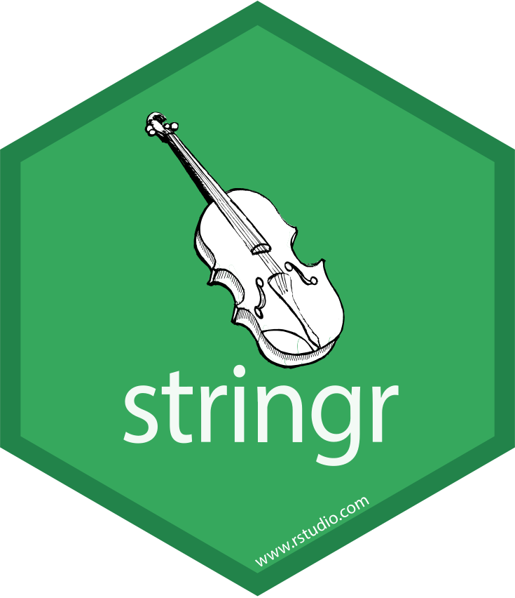
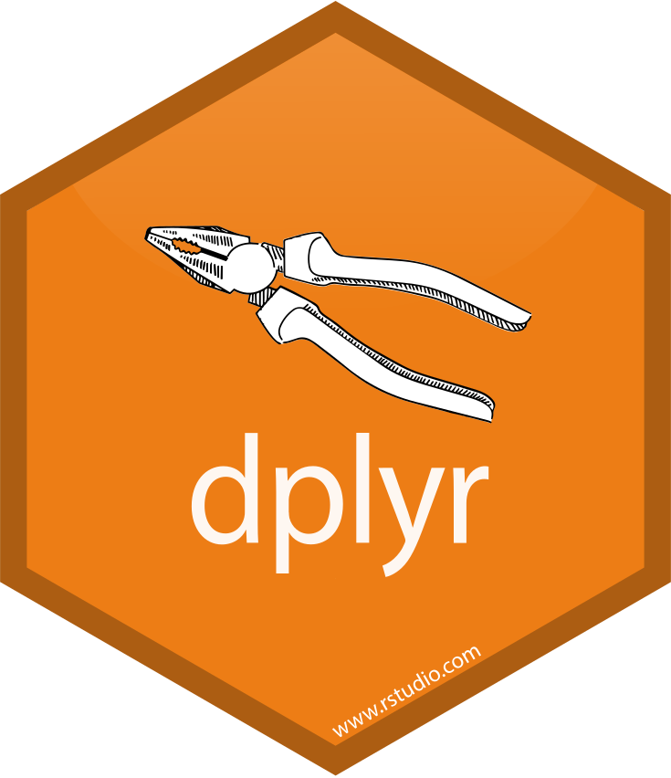
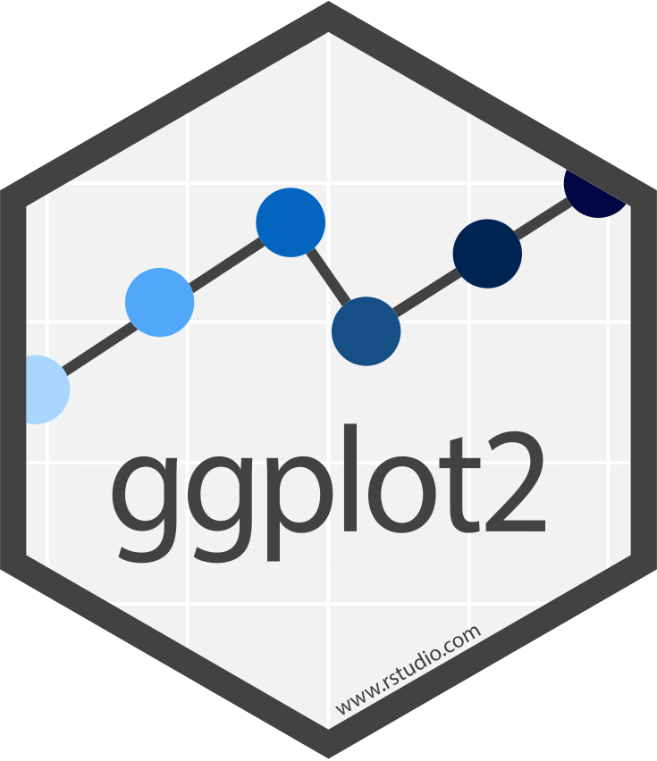

```{r, include=FALSE}
knitr::opts_chunk$set(dev = "svg")
```

# The Rise of Private Space Agencies 

```{r, message=FALSE, warning=FALSE, echo=FALSE}
library(tidyverse)
```


```{r, echo=FALSE, warning = FALSE, message=FALSE, fig.height = 5, fig.width=10, eval=FALSE}
launches <- 
  read_csv("https://raw.githubusercontent.com/rfordatascience/tidytuesday/master/data/2019/2019-01-15/launches.csv")

launches %>% 
  ggplot(aes(x = launch_year,
             fill = agency_type)) +
  geom_bar(alpha = .8, width = 1.02) +
  labs(x = "",
       y = "Space Launches [n]",
       fill = "Agency Type:") +
  scale_fill_manual(values = c("#27A6D3", "#FF6C0D", "#100089"),
                    guide = guide_legend(keyheight = .7, keywidth = 2)) +
  theme_minimal(base_size = 14) +
  theme(legend.position = "top")
```

---

class: blueblue, middle

.verybig[So what?]

--

.big[Let's start from the beginning...]


---

class: blueblue, middle, right

.big[Let's **read** the data...]

--

.big[...into an R **object**...]

--

.big[...and store it into a **variable**.]

---

# R understands you

Write something in the R console:

```{r}
2 # numbers
```


--

```{r}
"string of text must be quoted" # text
```

--

```{r}
2 + 2 # any mathematical operation

3^2
```

---

# R understands you

you can group together numbers

```{r}
c(1, 2, 5, 6, 8, 1, 45, .2, -1) # or numbers
```

--

operations are vectorized.

```{r}
c(1, 2, 5, 6, 8, 1, 45, .2, -1)*2 # also for numbers
```

---

# R understands you

The same for letters.

```{r}
c("you", "can", "group", "together", "strings", "of", "text")
```

--

```{r}
paste(c("you", "can", "group", "together",
        "strings", "of", "text"),
      collapse = " ") # operation are vectorized
```


---

class: blueblue, middle

.verybig[When you type something in R, R guesses what it is.]

---

# Everything in R is an object

And objects have types

--

```{r}
class(1)
```

--

```{r}
class("ciao")
```

--

```{r}
class(FALSE)
```

--

```{r}
class(mean)
```

---

class: exercise, middle

.exercise-title[Exercise:]

.exercise-body[put together objects of different classes in a vector with `c(..., ...)` and see what happens.]

---

### Only elements of one class fit in a vector, others are coherced.

```{r}
c(2,TRUE,5,FALSE,4)
```

--

```{r}
c("This", "sentence", "is", FALSE)
```

--

```{r}
c("The", 2, "sentences", "above", "are", TRUE)
```

--

```{r, error=TRUE}
whatisthis # but some objects aren't recognized
```

---

### For objects of different classes, you need lists

```{r}
list(1,
     "ciao",
     mean,
     c("You", "can", "put", "vectors", "into", "lists"))
```

---

# Wrap up

```{r, echo = FALSE}
tribble()
```

A table of R object...

---

class: blueblue, middle, right

.big[Let's **read** the data...]

.big[...into an R .orange[**object**]...]

.big[...and store it into a **variable**.]

---

class: blueblue, middle

.verybig[Unquoted text is a variable]

.big[With **`<-`**, you can store in it any object you want]

---

# Let's make things confusing

You can assign any object to a variable with ` <- `.

```{r}
a <- "b"
```

When you call the variables it returns the object that you have assigned to it.

```{r}
a
```

--

(same for numbers:)

```{r}
number_1 <- 2
number_1
```

---

### Any kind of objects

```{r}
some_numbers <- c(1,2,3)
some_numbers
```

--

```{r}
some_words <- c("This", "are", "not", "numbers")
some_words
```

---

class: blueblue, middle, right

.big[Let's **read** the **data**...]

.big[...into an R .orange[**object**]...]

.big[...and store it into a .orange[**variable**].]

---

class: blueblue, middle

.verybig[Some variables are already occupied]

---

class: exercise, middle

.exercise-title[Exercise]

.exercise-body[Can you find some variables that already have an object inside? What do they store?]

---

# Some variables already store data

```{r}
mpg
```

---

# Some variables already store data

```{r}
starwars
```

---

# Some variables already store data

```{r}
storms
```

---

class: exercise, middle

.exercise-title[Exercise]

.exercise-body[Check the data that we have already seen in R:

- How are they structured?
- What do they have in common?

]

---

# Don't try this at home

```{r}
a_list <-
  list(c(1,2,3,4,5),
       c(TRUE, FALSE, FALSE, TRUE, FALSE),
       c("Some", "text", "in", "this", "column"))

attributes(a_list)$row.names <- 1:5
attributes(a_list)$names <- c("my", "data", "frame")
attributes(a_list)$class <- "data.frame"
```

```{r, echo=FALSE}
a_list %>% as_tibble()
```

---

class: blueblue, middle, right

.big[Let's **read** the .orange[**data**]...]

.big[...into an R .orange[**object**]...]

.big[...and store it into a .orange[**variable**].]

---

class: blueblue, middle

.verybig[In R you do everything with functions]

---

# Some variables already store functions

```{r}
mean
```

```{r}
c
```

```{r}
plot
```

---
# Some variables already store functions

```{r}
read_csv
```

---

class: blueblue, middle

.big[.orange[f] ( .orange[Arg1] , .orange[Arg2], ...)]

--

.big[\> .orange[Output]]

---

# Example: how to use the `mean()` function

It takes numbers as the main input `x` and gives numbers as output:

```{r}
mean(x = 1)
```

--

You might want to know the mean of more than one number. Use a vector:

```{r}
mean(x = c(1,5,3,7,22,-34, 3.1, 0.4))
```

--

You can provide extra arguments, for example on how to deal with missing values.

```{r}
mean(x = c(1,5,3,7,22,-34, 3.1, 0.4, NA_real_), na.rm = TRUE)
```

---

# Example: how to use the `mean()` function

You can provide a variable as argument:

```{r}
some_numbers <- c(1,5,3,7,22,-34, 3.1, 0.4)
ignore_na_strategy <- TRUE
{{mean(x = some_numbers, na.rm = ignore_na_strategy)}}
```

--

And store the result in another variable:

```{r}
my_mean_value <- mean(x = some_numbers, na.rm = ignore_na_strategy)
```


`my_mean_value` now stores the output of the function:

```{r}
my_mean_value
```

---

# Example: how to use the `mean()` function

To access the help page of a function write its name after a question mark `?mean`.

(or search it on google...)

## Many packages are documented online

For example https://readr.tidyverse.org/

Help pages provide technical information on how to use the function, they don't introduce you to it, they are not discoursive. 

They don't tell you in which when, in which contect or in which combination you would use the function. For that you need books, vignettes and blog articles.

(Learning R on help pages is like learning biology - (from zero!) on peer reviwed articles)


---

class: blueblue, middle, right

.big[You can find functions in .orange[**Packages**]]


---

class: blueblue, middle

.verybig[Packages are organized collection of functions.]

.big[...with metadata and documentation]

---

class: blueblue, middle

.verybig[Why do we need packages?]

---

# For example, import CSV

We would like to read a csv into R.

There is a function that read the contents of text file, which is part of **base** R:

```{r}
# sample_file <- "https://raw.githubusercontent.com/rfordatascience/tidytuesday/master/data/2019/2019-01-15/launches.csv"

sample_file <- here::here("data/sample.csv")

readLines(con = sample_file, n = 5)
```

---

# For example, import CSV

But we don't need to call it directly, we can call a higher level functions that reads the contents from a CSV file and structures it in a dataframe.

```{r}
read.csv(file = sample_file, nrows = 5)
```

`read.csv` uses `readLines` an performs many other operations that are needed to read a CSV file into R.


---

# For example, import CSV

Sometimes you have many function that does the same job, and that have similar names! Tip: in doubt use the ones with the low dash "_" instead of the dot ".".

```{r, message=FALSE}
read_csv(sample_file)
```


---

class: exercise, middle

.exercise-title[Exercise]

.exercise-body[

Find a CSV or any kind of delimited text file and read it in R.

]

---

class: blueblue, middle

.verybig[Packages are there to implement a specific functionality]

.big[for example....]


---

# You can read data into R with reader

.center[

</p>
<a href="https://readr.tidyverse.org/" class="imagelink">
</a>
<p>

]

---

# You can pipe your operations with magrittr

.center[

</p>
<a href="https://magrittr.tidyverse.org/" class="imagelink">
</a>
<p>

]

---

# You can manipulate text with stringr

.center[

</p>
<a href="https://stringr.tidyverse.org/index.html" class="imagelink">
</a>
<p>

]

---

# You can manipulate data with dplyr

.center[

</p>
<a href="https://dplyr.tidyverse.org/" class="imagelink">
</a>
<p>

]

---

# You can apply functions with purrr

.center[

</p>
<a href="https://purrr.tidyverse.org/" class="imagelink">
</a>
<p>

]

---

# You can plot with ggplot2

.center[

</p>
<a href="https://ggplot2.tidyverse.org/" class="imagelink">
</a>
<p>

]

---

class: blueblue, middle

.verybig[We will see these packages in detail after lunch :)]

---

# To use a package must to take two steps:

First **install the package** on your laptop.

You must do this **only once**.

```{r, eval = FALSE}
install.packages("tidyverse")
```

Then, **load the package** in your R environment. 

You must do this in **every R session** (if you want to use that package). 

```{r, eval = FALSE}
library(tidyverse)
```


---

class: blueblue, orange

.verybig[But if you want....]

---

# You can write your own functions!

```{r}
per_due <- function(n = 1) n*2

per_due()

per_due(23) # Try it out
```

```{r}
greet <- function(person) {
  person <- stringr::str_to_title(person)
  paste0("Hi ", person, ", how are you?")
}

greet("Otho")
```

---

# You can write your own functions!

```{r}
hypot <- function(a = 1, b = 1) {
  sqrt(a^2 + b^2)
}

hypot(3, 4)
```

```{r, fig.height=2}
plot_blue_circle <- function(radius = .2) {
  grid::grid.circle(r = radius, gp = grid::gpar(fill = "#27A6D3"))
}

plot_blue_circle()
```

---

class: exercise, middle

.exercise-title[Exercise:]

.exercise-body[Write a function that checks if there is an ATG in a string of text (DNA).]

---

class: blueblue, middle, right

.big[Let's .orange[**read**] the .orange[**data**]...]

.big[...into an R .orange[**object**]...]

.big[...and store it into a .orange[**variable**].]

---

class: blueblue, middle

.verybig[Let's do it!]
---

# Data are on Github

https://github.com/rfordatascience/tidytuesday/tree/master/data/2019/2019-01-15

And it was used by the economist to perform [this viz](https://www.economist.com/graphic-detail/2018/10/18/the-space-race-is-dominated-by-new-contenders).

---

# You can find the data locally

in the data folder at the path `data/launches.csv`.

```{r}
library(readr)

launches_path <- here::here("data", "launches.csv")

launches <- read_csv(file = launches_path)
```

---

# And they are instantly ready for use

We read the data with `read_csv()` into an R ´tibble` object, and assigned them to the variable launches`

```{r}
launches
```

---

# Plotting in R is easy

```{r, fig.height=4, fig.width=12, message=FALSE}
ggplot(data = launches,
       mapping = aes(x = launch_year, fill = agency_type)) +
  geom_histogram()
```
