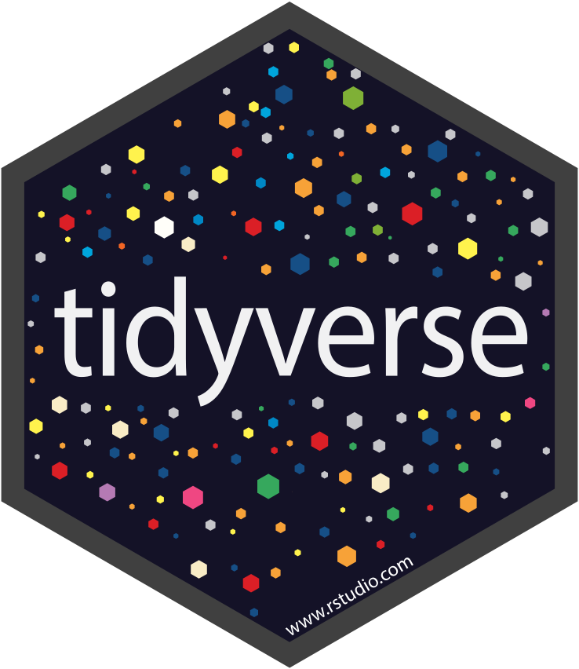
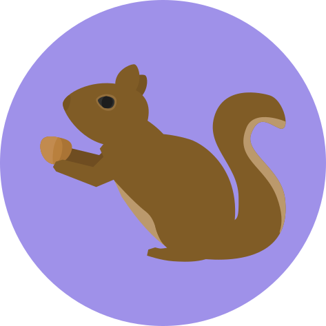

```{r setup, include=FALSE}
source(file = here::here("slides/libs-reveal/xaringan_reveal_parentheses_balanced.R"))
options(tibble.width = 55)
```


# The Tidyverse

.center[

</p>
<a href="https://www.tidyverse.org/" class="imagelink">
</a>
<p>

]

---

class: blueblue, middle

.verybig[The Tidyverse is a collection of packages for Data Science]

---


class: blueblue, middle

.big[.right[Let's practice it!]]

---

# NYC Squirrel Census


.pull-left[

Because:

.middle[

- It is large enough to provide a challenge.
- It is tidy and detailed,
- It stores quantitative and categorical variables,
- it stores spatial variables,
- it stores time variables.

]
]


.pull-right[
.center[

</p>
<a href="https://github.com/rfordatascience/tidytuesday/tree/master/data/2019/2019-10-29" class="imagelink">
</a>
<p>

]
]


---

# NYC Squirrel Census

`r emo::ji("squirrel")`

```{r, message=FALSE}
library(tidyverse)
```


```{r, message=FALSE}
squirrels_url <- paste0("https://raw.githubusercontent.com/rfordatascience/tidytuesday/",
                        "master/data/2019/2019-10-29/nyc_squirrels.csv")

squirrels <- read_csv(squirrels_url)
```

```{r squirrel-pipe-1, echo=FALSE, eval=FALSE}
squirrels %>% 
  select(lat_long,
         primary_fur_color,
         location) %>% 
  filter(primary_fur_color ==
           "Cinnamon") %>% 
  drop_na(location)
```

---

`r apply_reveal("squirrel-pipe-1")`

---

class: blueblue, middle

.big[.right[Run many operations in sequence

With the .orange[PIPE]]]

---

# The pipe operator

.pull-left[

.middle[

Most of the functions in the Tidyverse take a tibble as first argument and produce a tibble as an output.

```{r, eval=FALSE}
select(.data = squirrels,
       lat_long, primary_fur_color)
```


The pipe take whats on the left and passes it to the first argument of the function on the right.

```{r, eval=FALSE}
squirrels %>% 
  select(lat_lon, primary_fur_color) %>% 
  do_something() %>% 
  and_something_else()
```


]
]


.pull-right[
.center[

</p>
<a href="https://magrittr.tidyverse.org/" class="imagelink">
</a>
<p>

]
]

---

class: blueblue, middle

.big[.right[Ok, but which operation?]]

---


# DPLYR Verbs

.pull-left[

.middle[

DPLYR contains funcions that are Verbs for data manipulations

This verbs allow you to perform the operations that you want on data with a declarative synthax. You tell your computer what you want to do, not how to do it.

For example you can:

- select columns with `select()`,
- sort rows with `arrange()`,
- filter rows with `filter()`,

...and much more.


]
]


.pull-right[
.center[

</p>
<a href="https://dplyr.tidyverse.org/articles/dplyr.html" class="imagelink">
</a>
<p>

]
]

---

class: blueblue, middle

.big[.right[

.orange[Let's try it:]

How many .orange[gray] squirrels...

...where seen .orange[above ground]...

....orange[eating]...

...devided by .orange[age]

]]

```{r squirrel-pipe-2, eval = FALSE, echo = FALSE}
squirrels %>%
  select(primary_fur_color,
         location,
         eating, age) %>% 
  filter(primary_fur_color ==
           "Gray") %>% 
  filter(location ==
           "Above Ground") %>% 
  filter(eating) %>% 
  count(age)
```

---

`r apply_reveal("squirrel-pipe-2")`

---

class: exercise, middle

.exercise-title[Exercise:]

.exercise-body[

Count how many **Juvenile** squirrels... 

...where seen **foraging**...

...aggregated by **primary fur color**

]

---

class: exercise, middle

.exercise-title[Exercise:]

.exercise-body[

Which values does the column **other_activities** take?

Which value, besides NA, does it take most often?

]

---

class: exercise, middle

.exercise-title[Exercise:]

.exercise-body[

When squirrels are observed **above ground**...

...at what height are they on average?

]

```{r, eval = FALSE, echo = FALSE}
squirrels %>% 
  filter(!is.na(above_ground_sighter_measurement)) %>% 
  filter(above_ground_sighter_measurement != FALSE) %>% 
  summarise(mean_height = above_ground_sighter_measurement %>%
              as.numeric() %>%
              mean(na.rm = TRUE))
```


---

class: blueblue, middle

.verybig[We have identified one column that must be cleaned]

---

# Data Cleaning 1

Problem:

```{r, R.options=list(max.print=30)}
squirrels %>% pull(above_ground_sighter_measurement)
```

```{r}
squirrels %>% pull(above_ground_sighter_measurement) %>% class()
```

---

# Data Cleaning 1

solution:

```{r, R.options=list(max.print=50)}
squirrels %>% 
  rename(height = above_ground_sighter_measurement) %>% 
  mutate(height = height %>% {
             if_else(. == "FALSE", "0", ., NA_character_)
           }) %>% 
  mutate(height = height %>%
           as.numeric()) %>% 
pull(height)
```

---

# Data Cleaning 2

Problem: 

```{r, R.options=list(max.print=30)}
squirrels %>% pull(date)
```

```{r}
squirrels %>% pull(date) %>% class()
```

---

# Lubridate, because dates and times are special

.pull-left[

.middle[

Instead of trying to remember how many seconds are in an hour, how many days are in which month, and which year is a leap year, R has special objects and classes to store time, and to perform operations on it.

Lubridate makes it easier to deal with those objects.

```{r, eval=FALSE}
ymd(20101215)
#> [1] "2010-12-15"

mdy("4/1/17")
#> [1] "2017-04-01"
```


(from the package examples)

]
]


.pull-right[
.center[

</p>
<a href="https://dplyr.tidyverse.org/articles/dplyr.html" class="imagelink">
</a>
<p>

]
]

---

# Data Cleaning 2

Solution

```{r, message=FALSE}
library(lubridate)
```


```{r, R.options=list(max.print=15)}
squirrels %>% 
  mutate(date = mdy(date)) %>% 
  pull(date)
```

```{r}
squirrels %>% 
  mutate(date = mdy(date)) %>% 
  pull(date) %>% 
  class()
```

---

# Put it all together and assing it to a new variable

```{r squirrel-data-cleaning}
squirrels_tidy <-
  # assign to a new object
  squirrels %>% 
  # first part
  rename(height = above_ground_sighter_measurement) %>% 
  mutate(height = height %>% {
             if_else(. == "FALSE", "0", ., NA_character_)
           }) %>% 
  mutate(height = height %>%
           as.numeric()) %>% 
  # Second part
  mutate(date = mdy(date)) 
```

---
