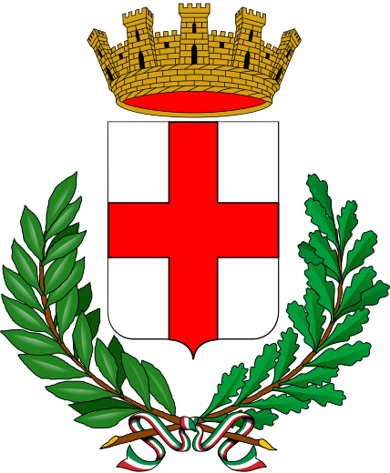

```{r setup, include=FALSE}
knitr::opts_chunk$set(dev = "svglite")
source(file = here::here("slides/libs-reveal/xaringan_reveal_parentheses_balanced.R"))
options(tibble.width = 55,
        tibble.max_extra_cols = 20)
library(tidyverse)
```

class: blueblue, middle

.big[More of the same...]

---

# Milano Open Data

.pull-left[

.middle[

The city of Milan releases carefully curated and well organized open data.

Check the website: https://dati.comune.milano.it/

Also Regione Lombardia has a great open data portal: https://www.dati.lombardia.it/

Did you know that, in **Europe**, you can ask for **Open Data** to the of public administration?

]
]


.pull-right[
.middle[

</p>
<a href="https://dati.comune.milano.it/" class="imagelink">
</a>
<p>

]
]

---

# Let's download some...


Air pollution in Milan: https://dati.comune.milano.it/dataset/ds417-rilevazione-qualita-aria-2019

```{r}
mil_url <- 
  paste0("http://dati.comune.milano.it/dataset/",
         "3e752fec-06fd-421b-ae9b-4d5d7a177640/",
         "resource/698a58e6-f276-44e1-92b1-3d2b81a4ad47/download/",
         "qaria_datoariagiornostazione_2019-11-12.csv")

mil_path <- here::here("data/qaria_datoariagiornostazione_2019-11-12.csv")
```


```{r, eval=FALSE}
download.file(url = mil_url,
              destfile = mil_path)
```


---

# Let's read the data...

```{r}
dat_mil <- read_csv(mil_path)
```

```{r}
dat_mil %>% print(n = 6)
```

---


class: exercise, middle

.exercise-title[Exercise:]

.exercise-body[

Describe the data:

- How are they structured? 
- What's stored in the columns? What's their type?
- Are there any NA?

]

---

# Six Pollutants over Eight Stations

.pull-left[

```{r}
dat_mil %>% 
  count(stazione_id)
```

]

.pull-right[

```{r}
dat_mil %>%
  count(inquinante)
```

]

---


class: exercise, middle

.exercise-title[Exercise:]

.exercise-body[

Use a visualization to learn when were the records taken?

]

```{r, eval = FALSE, echo = FALSE}
dat_mil %>% 
  ggplot(aes(x = data,
             y = inquinante)) +
  geom_text(label = "|")
```

```{r, eval = FALSE, echo = FALSE}
dat_mil %>% 
  ggplot(aes(x = data, 
             y = stazione_id)) +
  geom_text(label = "|")
```

---

```{r}
dat_mil %>% 
  group_by(stazione_id, inquinante) %>% 
  count()
```

---


class: exercise, middle

.exercise-title[Exercise:]

.exercise-body[

Count the NAs per column of the dataset.

]

```{r, echo = FALSE, eval = FALSE}
dat_mil %>% 
  map( ~ is.na(.) %>% sum())
```


---

# Explore the structure and completeness of the data visually.

```{r}
dat_mil %>% 
  ggplot(aes(x = stazione_id,
             y = inquinante,
             colour = is.na(valore))) +
  geom_count(alpha = .8)
```

---

# Some missing data are implicit

https://tidyr.tidyverse.org/reference/complete.html

```{r}
# complete
dat_mil_all <- 
  dat_mil %>%
  complete(stazione_id, nesting(data, inquinante))
```

```{r}
dat_mil_all %>% print(n = 6)
```


---

```{r}
dat_mil_all %>% 
  ggplot(aes(x = stazione_id,
             y = inquinante)) +
  geom_count()
```

---


class: exercise, middle

.exercise-title[Exercise:]

.exercise-body[

How would you visualize the amount of pollutants in the air by month?

Draw some sketches by hand.

What value would you map to what object of your sketch?

]